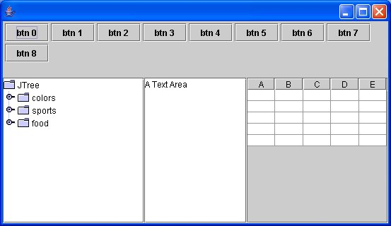

# Lesson 1 : My first application

In this first lesson, you will create your first Java Swing application using the VLDocking Framework.

## Application description

The Swing application we are going to create is very simple, it will be composed of 4 dockables :

* a Dockable for a text editor component.
* a Dockable for a JTree component
* a Dockable for a grid of buttons
* and finally, a Dockable for a JTable

This application being a kind of "Hello World", don't expect to get something useful from it (excepted your first knowledge of the framework).

### Source code

The final source code of the sample application can be found <a href="MyFirstFrame.html">here</a>.

## Creating the application components

We will start writing down our Application components (the "GUI blocks"), then we'll transform them into
dockables.

### The TextEditor component

This component is a JPanel containing a JScrollPane, containing a JTextArea. We start with a JPanel to be able to
add other components inside later (a toolbar, for example).

```java
    class MyTextEditor extends JPanel {
        JTextArea textArea = new JTextArea("A Text Area");

        public MyTextEditor() {
            setLayout(new BorderLayout());
            JScrollPane jsp = new JScrollPane(textArea);
            jsp.setPreferredSize(new Dimension(300, 400));
            add(jsp, BorderLayout.CENTER);
        }
    }
```

### The JTree component

This component is a simple JTree, and like for TextEditor, we will start with a  JPanel containing a JScrollPane, containing the JTree, for extension purposes.

```java
    class MyTree extends JPanel {
        JTree tree = new JTree();

        public MyTree() {
            setLayout(new BorderLayout());
            JScrollPane jsp = new JScrollPane(tree);
            jsp.setPreferredSize(new Dimension(200, 200));
            add(jsp, BorderLayout.CENTER);
        }
    }
```

### The Grid of Buttons component

This component simulates a palette window, or any command component used to
modify, say, the TextEditor contents.

```java
    class MyGridOfButtons extends JPanel {
        public MyGridOfButtons() {
            setLayout(new FlowLayout(FlowLayout.TRAILING, 3, 3));
            for (int i = 0; i < 3; i++) {
                for (int j = 0; j < 3; j++) {
                    add(new JButton("btn" + (i * 3 + j)));
                }
            }
            setPreferredSize(new Dimension(200,300));
        }
    }
```

### The Table component

This component is a JPanel containing a JScrollPane, containing a JTable.

```java
    class MyJTable extends JPanel {
        JTable table = new JTable();

        public MyJTable() {
            setLayout(new BorderLayout());
            table.setModel(new DefaultTableModel(5, 5));
            JScrollPane jsp = new JScrollPane(table);
            jsp.setPreferredSize(new Dimension(200, 200));
            add(jsp, BorderLayout.CENTER);
        }
    }
```

## Creating the Frame

Our frame object will be a standard JFrame subclass, with a main() method for testing purposes.

```java
    public class MyFirstFrame extends JFrame {
        MyTextEditor editorPanel = new MyTextEditor();
        MyTree treePanel = new MyTree();
        MyGridOfButtons buttonGrid = new MyGridOfButtons();
        MyJTable tablePanel = new MyJTable();

        public MyFirstFrame() {
            setDefaultCloseOperation(DISPOSE_ON_CLOSE);
            getContentPane().add(editorPanel, BorderLayout.CENTER);
            getContentPane().add(treePanel, BorderLayout.WEST);
            getContentPane().add(buttonGrid, BorderLayout.NORTH);
            getContentPane().add(tablePanel, BorderLayout.EAST);
        }

        public static void main(String[] args) {
            MyFirstFrame frame = new MyFirstFrame();
            frame.setSize(800,600);
            frame.validate();
            SwingUtilities.invokeLater(new Runnable() {
                // in the event dispatch thread
                public void run() {
                    frame.setVisible(true);
                }
            };
        }
    }
```

Launching this application should give us something like that :



_My First Frame, without docking)_

This is the kind of frame layout a standard Swing application would have (although a little bit better, using JSplitPanes or JInternalFrames).

----

Next : [And now... docking !](tutorial1page2.md)
