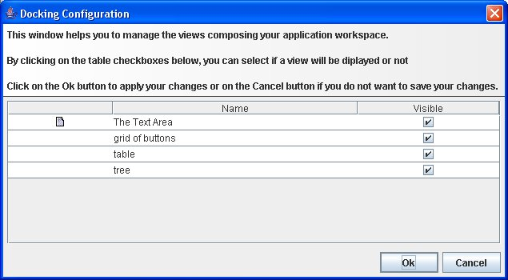

# Lesson 6 : Tips and tricks 


This is the 6th part of the VLDocking Framework tutorial for Java Swing applications.


In this tutorial, you will learn some useful tips about VLDocking.


## Visual tips

### Notifications


A notification mecanism is available on the DockKey component.


Although simple, it gives you a means to attract user attention on a Dockable.


The default implementation makes the title bar/autohide-button blink until the
dockable container gets the keyboard focus.


To use it, simply call `setNotification(true)` on the dockable's DockKey.

### Changing the default location of auto-hide buttons 


You have a two level access to the border used to show auto-hide buttons :
 

* Global : use `AutoHidePolicy.getPolicy().setDefaultHideBorder(DockingConstants.Hide hide);`
     

This will put the auto-hide button on the selected border.
     

     

For example, to put the buttons at the bottom of the desktop, use :

```java
    AutoHidePolicy.getPolicy().setDefaultHideBorder(DockingConstants.HIDE_BOTTOM);
```
     
 
* Local : use the `DockKey` instance method `setAutoHideBorder(DockingConstants.Hide hide)`
       to select the border used for that Dockable.
     
The Local setting is evaluated before the Global setting, and global setting is
         used only if the local setting is `null`.
     

For example, to put the editorPanel button on the right border of the desktop, use :

```java
    editorPanel.getDockKey().setDefaultHideBorder(DockingConstants.HIDE_RIGHT);
```


*Note* : Have a look at the AutoHidePolicy class, as it contains other customizations
  of the auto-hide buttons and borders (gap between buttons, click or rollover selection...).


## Other tips 

### The DockingSelectorDialog 
  

The `com.vlsolutions.swing.docking.DockingSelectorDialog` will have
its own lesson soon. From now on, look at its javadoc : it is a helpfull class
you can use to let the user choose the dockables to show and
those to close.


It is also customizable : you can change the "wizard label", and every other
text displayed.


Look at the following screenshot to have an idea of what it looks like :

 

 _The Docking Selector Dialog_
 
----

Next : [Lesson 7 - Heavyweight components](tutorial7.md)
